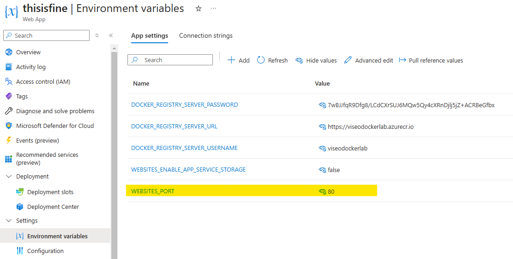

# 20

## Create Web App


Wait for a minutes...


## Configure Web App

Don't forget to add `WEBSISTES_PORT` to your Web App's environment variables and set it to the value specified in your `Dockerfile`

```dockerfile
FROM nginx:alpine

COPY index.html /usr/share/nginx/html/index.html
COPY video.mp4 /usr/share/nginx/html/video.mp4

EXPOSE 80 # <--- this value
```



## Enjoy


