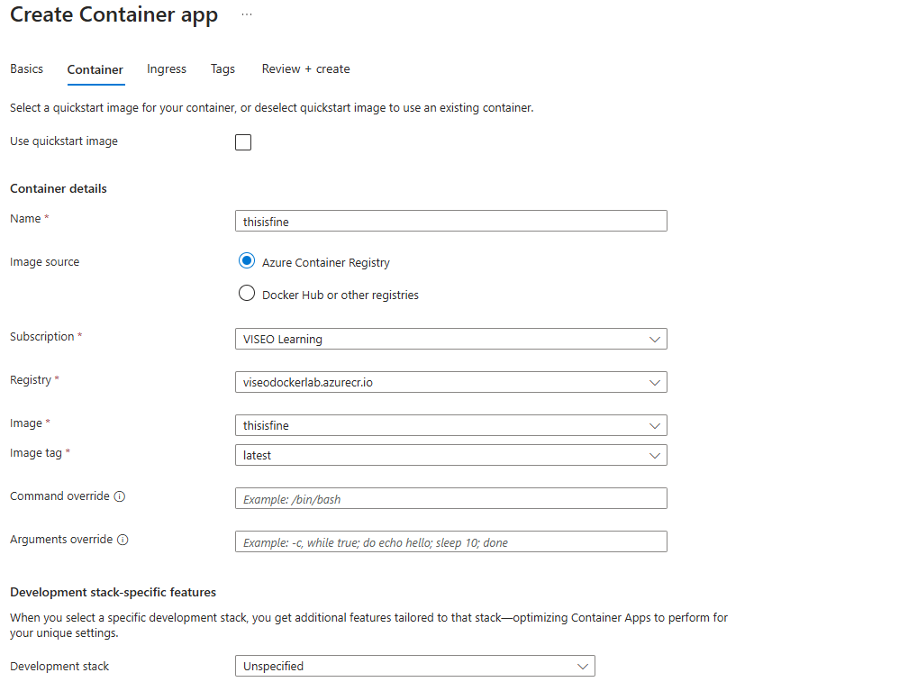

# 21

## Create Azure Container App


Now you can select the Docker image by choosing the Azure Container Registry and then, the Docker image and version




At this moment, you can configure the **Ingress** settings or do it later


Wait for a minutes...


## Configure Azure Container App

If you want to accept traffic from anywhere you should enable **Ingress** and mark the option *Accepting traffic from anywhere*

Don't forget configure *Target port* option and set it to the value specified in your `Dockerfile`

```dockerfile
FROM nginx:alpine

COPY index.html /usr/share/nginx/html/index.html
COPY video.mp4 /usr/share/nginx/html/video.mp4

EXPOSE 80 # <--- this value
```


## Enjoy


## Notes

- If your Azure Container Registry is located in the same region as your Azure Container App, you can enable *continuous deployment*. This means that whenever you push a new image version to Azure Container Registry, a webhook will trigger an update in Azure Container App, automatically creating a new revision.
